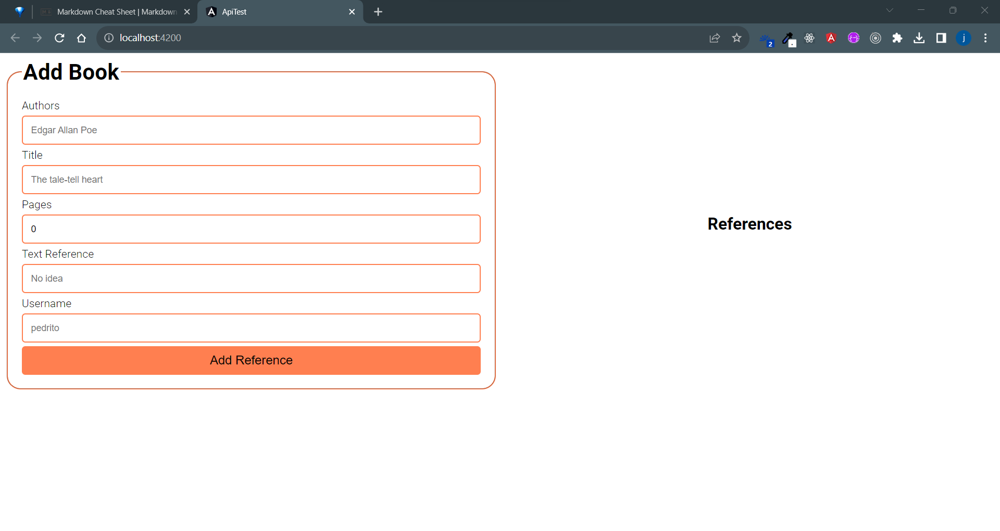
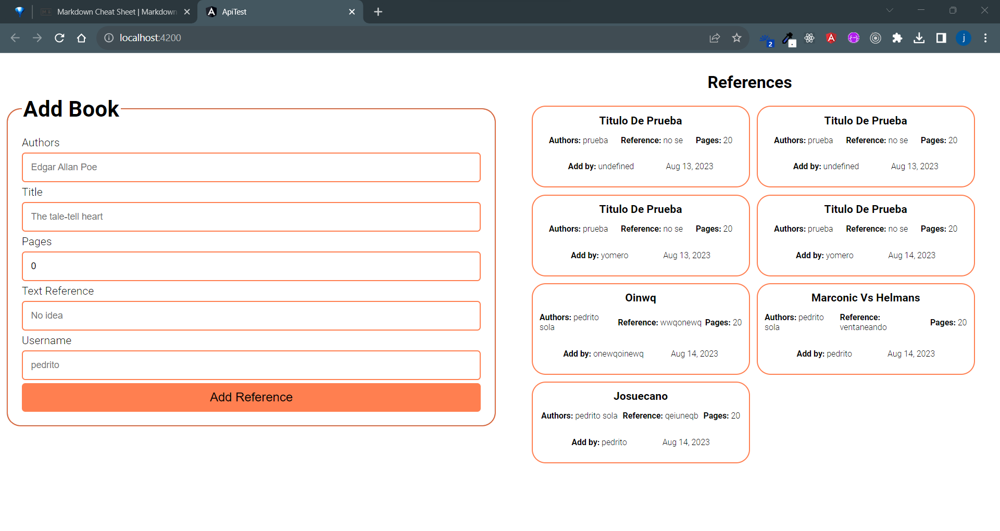

# Prueba Becario 2

Para esta prueba se pide consumir una API de prueba que realiza una conexion a una Base de datos local y permite crear y obtener datos, en este caso referencias.
La api fue proporcionada por los entrevistadores.

## Proyecto

Para ver el proyecto en local, hace falta la api proporcionada, clonar este repo, ya con las dos cosas.

1. Iniciar el servidor de mysql.
2. Inicial la api con un `npm test`
3. Iniciar el proyecto con `ng serve -o` o `npm start`.

## Agregar referencias

Para agregar datos a la base, cree un formulario, donde se piden titulo, autor , número de páginas, referencia y username.
Una vez rellenados todos los campos de manera correcta al oprimir el boton add. Estos datos se envian en el body de una petición POST.
Si la referencia fue agregada con éxito se muestra un mensaje en pantalla.

Imagen Agregar Referencia

## Lista de referencias

Ya que se agrego una o varias referencias del lado derecho se mostraran unas cards con la info de la referencia.

Imagen Cards Referencias.

Al agregar nuevas referencias estas tambien se iran agregando al listado

Imagen Nueva Referencia

